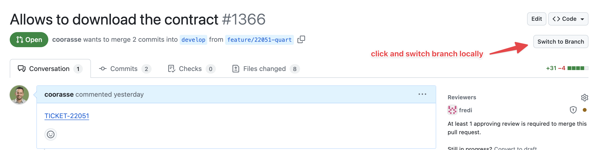

# GitHub PR Branch Switcher

Easily switch to GitHub PR branches from your local environment using a Chrome extension and a local daemon server.

## Features

- 🖱️ Adds a "Switch to Branch" button on GitHub PR pages
- 🚀 Automatically switches to the branch in your local environment
- 🔄 Runs as a daemon server on your local machine



## Setup Instructions

### 1. Clone the Repository

```sh
git clone https://github.com/yourusername/github-pr-branch-switcher.git
cd github-pr-branch-switcher

### 2. Run the Setup Script

```sh
bin/setup
```

This script will:
* Install the necessary Ruby gems (sinatra, sinatra-cors)
* Make the server script executable
* Create and load a launch agent to run the server as a daemon

### 3. Install the Chrome Extension
* Open Chrome and go to chrome://extensions/
* Enable "Developer mode"
*  Click "Load unpacked" and select the github-pr-branch-switcher directory

### 4. Using the Extension
* Navigate to a GitHub pull request page, and you will see a "Switch Branch" button. Click the button to switch to the PR branch in your local environment.

## Uninstalling the Daemon
To uninstall the daemon server, run:

```sh
bin/uninstall
```

This script will unload the launch agent and remove the plist file.

Made with ❤️ by Renuo
